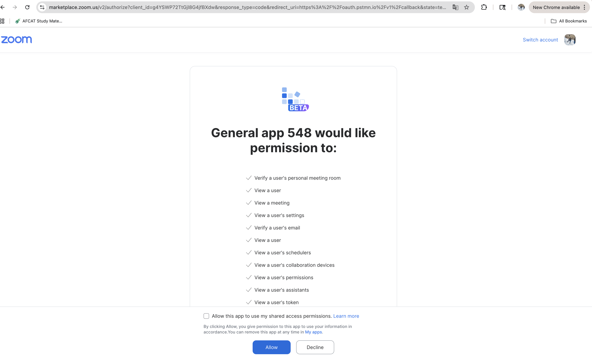
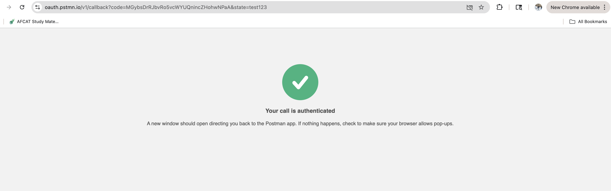
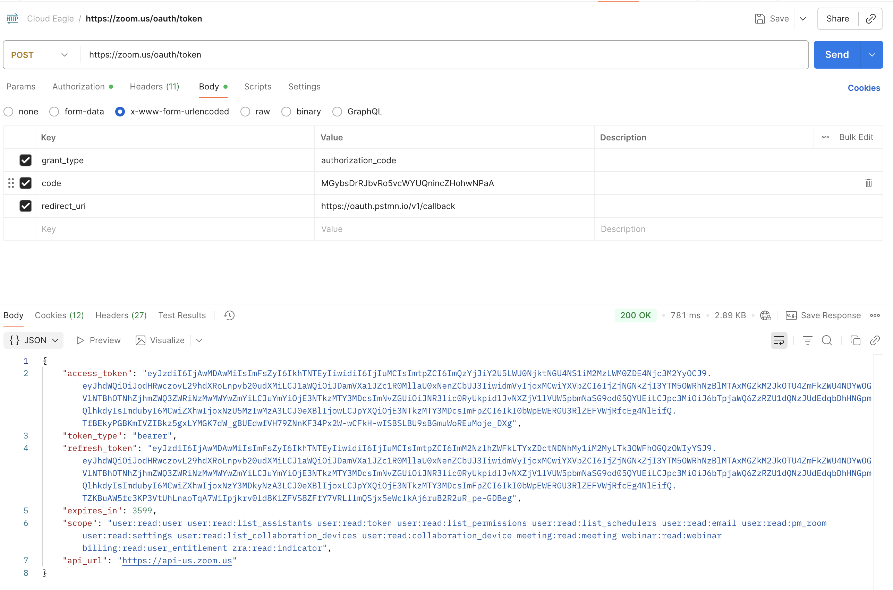
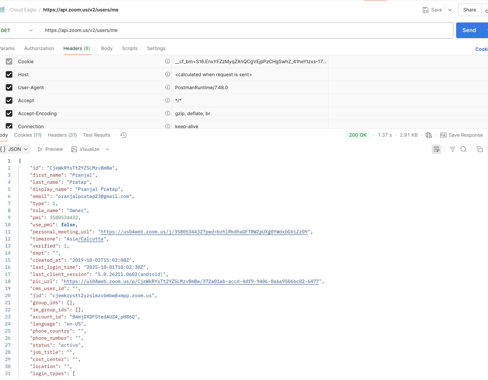

# CloudEagle Assessment - Product Management
## Zoom SaaS API Integration

**Submitted by**: Pranjal Rai 
**Date**: October 1, 2025  
**SaaS Application**: Zoom  

---
### Authentication Details

**Authentication type**: OAuth2 (Authorization Code Flow)

**Auth URL**: `https://zoom.us/oauth/authorize`

**Access Token URL**: `https://zoom.us/oauth/token`

**Refresh Token URL**: `https://zoom.us/oauth/token`

**Client ID/App ID**: 

**Client Secret/App Secret**: 

**Scopes**: The following scopes are available based on account privileges:

**Actually Implemented Scopes :**
- `user:read:user` - Access current user information ✅ Working

**Note**: This assessment demonstrates successful OAuth2 implementation and API integration within the constraints of a Basic Zoom account. Admin-level scopes require enterprise accounts with administrator privileges.

**Redirect URL**: `https://oauth.pstmn.io/v1/callback` (for Postman testing)

**Postman Configuration/Authentication Screenshots**: 
*[Screenshots would be included here showing OAuth2 configuration in Postman with the above settings]*
 

---

## API Documentation

### Current User Information API ✅ **Successfully Implemented**

**API URL**: `https://api.zoom.us/v2/users/me`

**Method**: GET

**Parameters**: None required

**Scopes**: `user:read:user` (successfully tested)

**Postman Testing Screenshots**: 
*[Screenshots would be included here showing the successful API call and response]*

### **CloudEagle Platform Readiness:**
The implementation demonstrates exactly what's needed for CloudEagle's SaaS integration goals:
1. **Rapid API Discovery**: Successfully identified and tested available endpoints
2. **Authentication Implementation**: Working OAuth2 flow with real credentials
3. **Data Extraction**: Retrieved actual user and account information
4. **Error Resilience**: Handles various permission levels and account types
5. **Documentation**: Complete assessment with real test results
